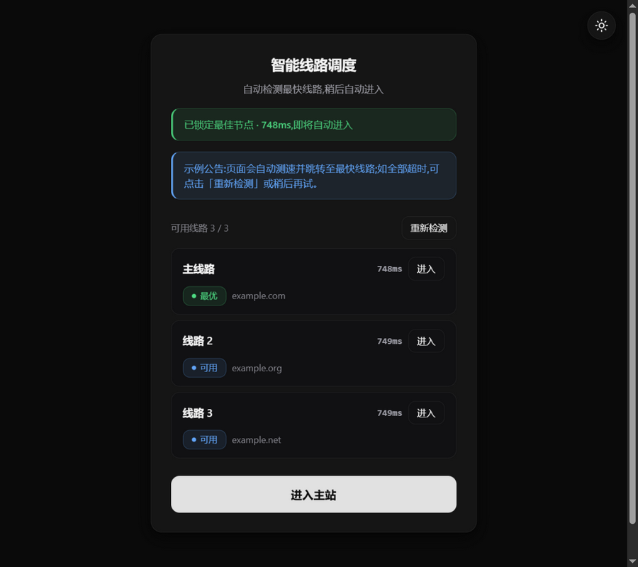
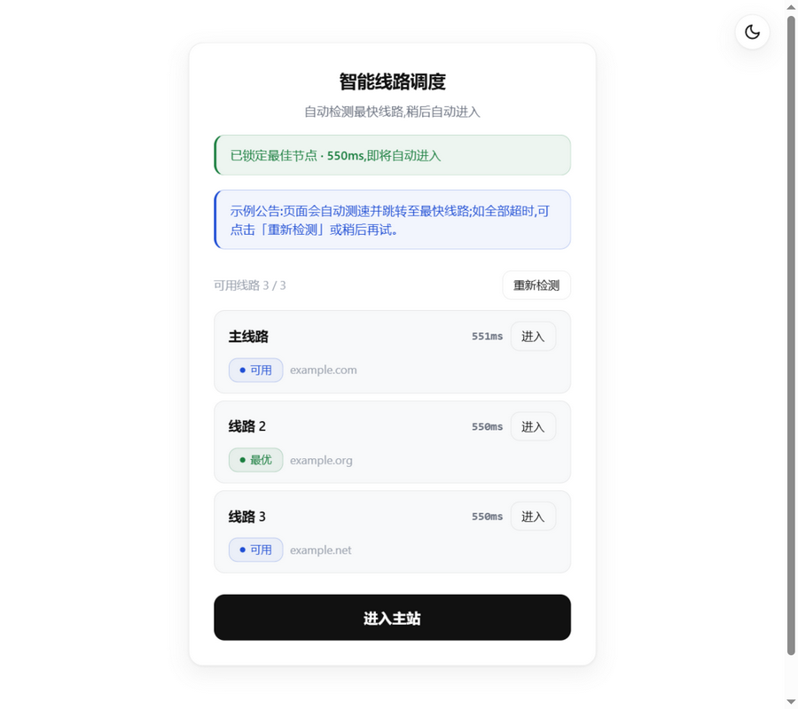
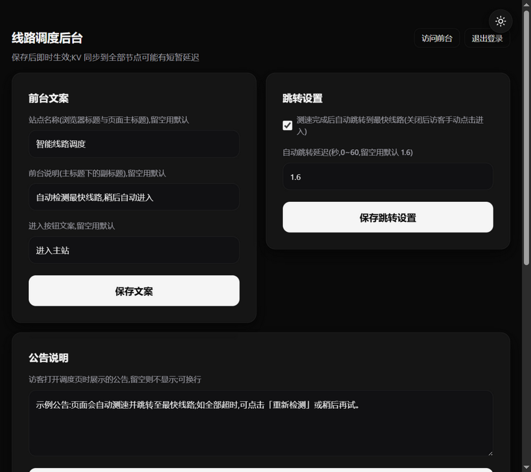
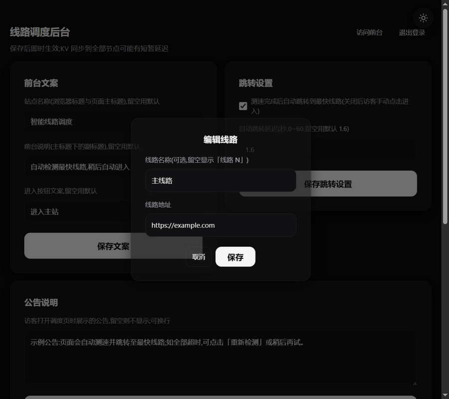

# Cloudflare HitNav · 智能线路调度

基于 **Cloudflare Workers + KV** 的多线路调度入口:访客打开页面自动测速,几秒内跳转到最快的可用线路;内置密码保护的管理后台(`/admin`),可在网页上增删线路、调整顺序、编辑公告,保存后即时生效。适用于任何多域名站点的导航分发场景。

> 前端为手写 CSS 的「毛玻璃卡片 + 中性色」设计系统:暗色默认、亮暗双主题、语义色仅用于状态标识,详见文末[设计系统](#设计系统)。

## 界面预览

| 前台 · 暗色 | 前台 · 亮色 |
| --- | --- |
|  |  |

| 后台管理 | 编辑线路 |
| --- | --- |
|  |  |

## 一键部署

[](https://deploy.workers.cloudflare.com/?url=https://github.com/lengxiv/cloudflare-hitnav)

点击按钮 → 登录 GitHub 并授权 → Cloudflare 会自动拉取本仓库、创建 Worker 并开通 KV 命名空间(绑定 `CONFIG`)。

部署完成后**必须**做一件事:进入该 Worker 的 **设置 → 变量和机密**,添加变量 `ADMIN_PASSWORD`(类型选「机密」),否则后台不可用。之后访问 `https://你的域名/admin` 即可登录。

> 若部署流程未自动创建 KV,按下方「方式二」手动绑定一次即可。
> 若你 **fork 后部署到自己的账户**:请先清空 `wrangler.toml` 中 `[[kv_namespaces]]` 的 `id`,让流程自动创建。

## 功能特性

**前台 `/`**

- 并行测速全部线路(请求各站点 `favicon.ico`,5 秒超时),自动锁定最快节点并跳转
- 每条可用线路提供「进入」按钮,可手动选择;工具栏支持「重新检测」
- 线路 300ms 内标记「最优」,900ms 内为「可用」,否则「超时」
- 后台配置的公告以 info 横幅展示,支持多行
- 暗色为默认主题,右上角 40px 圆形按钮切换亮/暗,偏好写入 localStorage
- 微信 / QQ 内置浏览器自动弹窗引导「在浏览器中打开」
- 加载使用骨架屏动画,尊重 `prefers-reduced-motion`,键盘焦点可见

**后台 `/admin`**

- 管理密码登录,HMAC-SHA256 签名 Cookie 会话(7 天有效)
- 线路管理:添加(自动补 `https://`、去重、去路径、上限 20 条)、编辑(名称与地址,走弹窗)、删除(两击确认)、上移 / 下移排序;线路名称留空时前台显示「线路 N」
- 公告说明:多行文本,保存后前台立即生效
- 跳转设置:自动跳转开关与延迟秒数(0~60,默认 1.6 秒);关闭后访客手动点击进入
- 全部操作即时保存,横幅反馈成功 / 失败
- 未绑定 KV 或未设置密码时,后台显示配置引导页

## 部署

### 方式一:一键部署

见上方「一键部署」按钮,适合最快上手。

### 方式二:Cloudflare 控制台(手动粘贴)

1. 控制台 → **Workers 和 Pages** → 创建 Worker,把 [`worker.mjs`](./worker.mjs) 的全部内容粘贴进编辑器并部署;
2. **存储和数据库 → KV** → 创建一个命名空间(例如 `dispatch-config`);
3. 回到 Worker → **设置 → 变量和机密 → KV 命名空间绑定**,变量名填 `CONFIG`,选择刚创建的命名空间;
4. 同页添加变量 `ADMIN_PASSWORD`(类型选**机密**),值即后台登录密码;
5. 访问 `https://你的域名/admin` 登录后台。

> 不绑定 KV 时前台照常运行,使用代码内的占位示例线路(example.com / net / org),仅后台不可用;部署后请在后台配置你自己的线路。

### 方式三:Wrangler CLI

```bash
npm install -g wrangler
wrangler login

# 创建 KV 并把返回的 namespace id 填进 wrangler.toml
wrangler kv namespace create CONFIG

# 设置后台密码
wrangler secret put ADMIN_PASSWORD

wrangler deploy
```

## Git 自动部署(可选)

把 GitHub 仓库绑定到 Worker 后,每次 `git push` 会自动构建并部署:

1. 控制台 → **Workers 和 Pages** → `cloudflare-hitnav` → **设置 → 构建 → 连接 Git 仓库**;
2. 选择 GitHub,按提示安装 **Cloudflare Workers and Pages** GitHub App 并授权 `lengxiv/cloudflare-hitnav`;
3. 部署命令保持默认 `npx wrangler deploy`,分支 `main`,保存即可。

绑定后改代码 → push → 一两分钟内自动上线,无需手动重新部署。`wrangler.toml` 已指向当前 KV 命名空间,自动部署不会影响后台数据。

## 本地预览

仓库内附带一个完整模拟 Worker 行为(内存 KV + 会话)的预览服务器:

```bash
node preview/server.mjs
```

- <http://127.0.0.1:8791/> — 前台(真实测速)
- <http://127.0.0.1:8791/?mock> — 前台(模拟全部线路 550ms 可达,演示自动跳转)
- <http://127.0.0.1:8791/admin> — 后台(登录密码 `test1234`)
- <http://127.0.0.1:8791/live> — 由 Worker 直出的前台,后台修改后可实时验证

接口自检脚本:

```bash
node preview/api-check.mjs
```

## 配置参考

| 配置 | 位置 | 说明 |
| --- | --- | --- |
| `CONFIG` | KV 命名空间绑定 | 全部后台数据的存储,必需(后台) |
| `ADMIN_PASSWORD` | 环境变量 / 机密 | 后台登录密码,建议使用随机长密码 |
| `MAX_LINES` | 代码内常量 | 线路数量上限,默认 20 |
| `SESSION_TTL` | 代码内常量 | 登录会话有效期,默认 7 天 |
| `PING_TIMEOUT` / `USABLE_MS` | 前台脚本内常量 | 测速超时 5s;≤900ms 判为可用 |

## 后台 API

| 接口 | 方法 | 说明 |
| --- | --- | --- |
| `/admin/api/login` | POST | `{ "password": "..." }`,成功下发会话 Cookie |
| `/admin/api/logout` | POST | 注销会话 |
| `/admin/api/config` | POST | 保存 `{ "lines": [...], "announcement": "..." }`,需登录 |

## 目录结构

```
cloudflare-hitnav/
├── worker.mjs               # Worker 全部代码(前台 + 后台 + 样式)
├── wrangler.toml            # Wrangler 部署配置(KV 绑定需填 namespace id)
└── preview/
    ├── server.mjs           # 本地预览服务器(模拟 KV)
    ├── preview.mjs          # 生成三个页面的静态快照
    └── api-check.mjs        # 后台接口自检
```

## 设计系统

- 颜色 / 圆角 / 阴影 / 动效时长全部语义化为 CSS 变量,亮色定义在 `:root`,暗色在 `[data-theme='dark']` 成对覆盖
- 语义色 `success / danger / warn / info` 只用于状态标识(徽章、横幅),不做装饰
- 动效:hover/press 140ms,入场 220ms,统一 `cubic-bezier(0.22, 1, 0.36, 1)`,按压缩放 `scale(0.98)`
- 组件:毛玻璃卡片、通栏主按钮 + 幽灵按钮、两行式列表行、带状态圆点的徽章、语义横幅、骨架屏、弹窗

## 声明

本项目仅用于个人学习与技术研究,请遵守所在地区的法律法规,勿用于任何违法违规用途。
